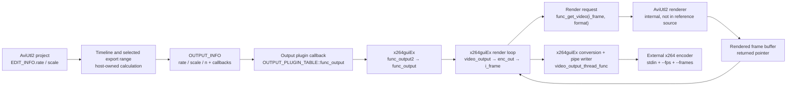

# AviUtl2 render/output pipeline (Phase 1)

## Scope and evidence boundary

This document covers the public AviUtl2 Plugin SDK snapshot in
`reference/aviutl2_sdk`, the AviUtl2-specific x64 path in
`reference/x264guiEx`, and the minimal probe in `experiments/render_probe`.
It does not claim knowledge of renderer implementation details that are absent
from the SDK and x264guiEx sources.

The public boundary is clear: the host supplies one `OUTPUT_INFO`, invokes the
output plugin once through `OUTPUT_PLUGIN_TABLE::func_output`, and exposes video
as `func_get_video(int frame, DWORD format)`. There is no timestamp or fractional
frame argument at this boundary
(`reference/aviutl2_sdk/output2.h:36-83`, symbols `OUTPUT_INFO`,
`func_get_video`).

## Concrete call/data-flow diagram

The output plugin controls when an integer frame is requested; AviUtl2 owns the
render operation behind the callback and the lifetime of the returned buffer.
This control/data return is why the rendered-frame arrow comes back to the
plugin loop rather than flowing independently into it
(`reference/aviutl2_sdk/output2.h:48-57`).

## Stage-by-stage evidence

| Stage | Relevant functions and data | Exact source | Boundary |
|---|---|---|---|
| Project/scene | `EDIT_INFO::rate`, `scale`, `frame_max`, selection fields; `SCENE_INFO::rate`, `scale` | `reference/aviutl2_sdk/plugin2.h:130-149`; `reference/aviutl2_sdk/filter2.h:320-325` | Public API representation. `frame_max` is the maximum frame index containing an object, not a documented export-frame-count formula. |
| Timeline/export selection | Host chooses the export range and constructs output information. AviUtl2 also supports selected-range file output. | `aviutl2_v2.1.4/aviutl2.txt:738`; output result is visible in `reference/aviutl2_sdk/output2.h:36-46` | Host internal. No source here exposes the calculation. |
| Output handoff | `OUTPUT_PLUGIN_TABLE::func_output(OUTPUT_INFO*)`; `OUTPUT_INFO::rate`, `scale`, `n` | `reference/aviutl2_sdk/output2.h:36-46,87-101` | Public output API. |
| Render request | `OUTPUT_INFO::func_get_video(int frame, DWORD format)` | `reference/aviutl2_sdk/output2.h:48-57` | Public callback, integer frame only. |
| Host render | Implementation behind `func_get_video` | Not present in either reference tree | Internal/unknown. The SDK contract proves the input shape, not the host's private symbol chain or scheduling algorithm. |
| SDK sample loop | `AviSaver::func_output` loops `frame = 0 .. oip->n-1`, calls `func_get_video(frame, BI_RGB)`, and derives audio ranges from `frame`, `rate`, and `scale` | `reference/aviutl2_sdk/AviSaver.cpp:65-138`, especially `117-133` | Public API consumer and canonical sample. |
| x264guiEx entry | `GetOutputPluginTable` returns the AviUtl2 table whose output callback is `func_output2`; target-2 `func_output2` calls internal `func_output` | `reference/x264guiEx/x264guiEx/x264guiEx.cpp:102-138,373-402` | Exported ABI, then plugin-internal. |
| x264guiEx setup | `func_output` calls `init_enc_prm`, `set_enc_prm`, `check_output`, optional AFS setup, then dispatches video/audio work | `reference/x264guiEx/x264guiEx/x264guiEx.cpp:263-367` | Plugin-internal. `OUTPUT_INFO` is consumed, not constructed. |
| x264guiEx render loop | `video_output` → `video_output_inside` → `enc_out`; local `i_frame` increments through `frames_to_enc = oip->n`; each iteration calls `func_get_video_ex(i_frame, format)` or the AFS wrapper | `reference/x264guiEx/x264guiEx/encode/auo_video.cpp:791-1005,1248-1300` | Plugin-internal loop calling public host callback. |
| AviUtl2 callback alias | On target version 2, `func_get_video_ex` aliases to `func_get_video` | `reference/x264guiEx/x264guiEx/auo.h:38-49` | Compile-time compatibility layer. |
| Returned frame/convert | `enc_out` converts the returned buffer into plugin-owned pixel data and signals the writer | `reference/x264guiEx/x264guiEx/encode/auo_video.cpp:975-997` | Plugin-internal. |
| Encoder input | `video_output_thread_func` writes converted planes to encoder stdin | `reference/x264guiEx/x264guiEx/encode/auo_video.cpp:704-733` | Plugin-internal/external-process boundary. |
| Encoder timing | `build_full_cmd` supplies `--frames` from `oip->n` (adjusted for x264guiEx drop/delay bookkeeping) and `--fps` from reduced `oip->rate/oip->scale` | `reference/x264guiEx/x264guiEx/encode/auo_video.cpp:455-501` | Plugin/encoder metadata. It does not create new host render samples. |

## Actual x264guiEx call chain

For the AviUtl2 x64 build, the traced path is:

1. AviUtl2 loads the `.auo2` plugin and calls exported
   `GetOutputPluginTable()` (`x264guiEx.cpp:132-138`).
2. The returned `output_plugin_table` maps `func_output` to `func_output2`
   (`x264guiEx.cpp:115-127`).
3. AviUtl2 invokes `func_output2(OUTPUT_INFO*)`; it calls plugin-internal
   `func_output(oip)` (`x264guiEx.cpp:373-402`).
4. `func_output` initializes/checks parameters and dispatches to
   `video_output` (`x264guiEx.cpp:263-367`).
5. `video_output` wraps `video_output_inside`, which calls `enc_out`
   (`encode/auo_video.cpp:1248-1300`).
6. `enc_out` sets `frames_to_enc = oip->n`, launches the encoder/writer, and
   advances local `i_frame` once per input-loop iteration
   (`encode/auo_video.cpp:848-907`).
7. The normal path requests
   `oip->func_get_video_ex(i_frame, aviutl_color_fmt)`
   (`encode/auo_video.cpp:970-980`). For AviUtl2, that name is a macro alias for
   public `func_get_video` (`auo.h:38-49`).
8. `enc_out` converts/copies the returned image and signals the writer
   (`encode/auo_video.cpp:986-991`).
9. `video_output_thread_func` writes the planes to the external encoder's stdin
   (`encode/auo_video.cpp:704-733`).

When AFS is enabled, `afs_get_video` wraps the same integer callback, caches the
requested index and sometimes `frame + 1`, and remains bounded by `oip->n`
(`reference/x264guiEx/x264guiEx/encode/afs_client.h:213-282`). This is frame
filtering/drop logic, not timestamp-based resampling.

### Structures and current-frame handling in x264guiEx

- `OUTPUT_INFO` is the live render/output structure. x264guiEx reads its
  dimensions, flags, FPS, count, audio properties, save path, and callbacks; it
  does not retrieve those values through another host function or construct a
  replacement structure (`reference/x264guiEx/x264guiEx/output2.h:35-84`;
  `reference/x264guiEx/x264guiEx/x264guiEx.cpp:263-367`).
- `OUTPUT_PLUGIN_TABLE` is the entry/config table returned to AviUtl2
  (`reference/x264guiEx/x264guiEx/output2.h:86-121`;
  `reference/x264guiEx/x264guiEx/x264guiEx.cpp:102-138`).
- `PROJECT_FILE` is only the public persistence interface for string/binary
  parameters and the project path; it has no FPS, frame count, or rendering
  callback (`reference/x264guiEx/x264guiEx/project2.h:9-42`). x264guiEx's project
  callbacks serialize its JSON `config` setting
  (`reference/x264guiEx/x264guiEx/x264guiEx.cpp:148-176`).
- For AviUtl2, the active current render index is the local `i_frame` in
  `enc_out`. The legacy `func_get_flag` copy-frame handling and preview-update
  callback are inside `AVIUTL_TARGET_VER == 1` branches, so they are not part of
  the target-2 path (`reference/x264guiEx/x264guiEx/encode/auo_video.cpp:970-1004`;
  target selection in `reference/x264guiEx/x264guiEx/auo.h:38-49`).

## Answers to the Phase 1 questions

### 1. How is project FPS represented?

The public editing API represents scene/project FPS as the rational pair
`EDIT_INFO::rate / EDIT_INFO::scale`
(`reference/aviutl2_sdk/plugin2.h:132-138`). `SCENE_INFO` repeats the same scene
pair for filter processing (`reference/aviutl2_sdk/filter2.h:320-325`). The
output plugin receives one rational pair in `OUTPUT_INFO::rate / scale`
(`reference/aviutl2_sdk/output2.h:36-42`). The SDK does not expose a second
render-sampling FPS field in `OUTPUT_INFO`.

### 2. How is total frame count calculated?

The formula is not public. `EDIT_INFO::frame_max` is documented as the maximum
frame index on which an object exists, while `OUTPUT_INFO::n` is simply the
frame count handed to an output plugin
(`plugin2.h:132-145`; `output2.h:36-42`). Selected-range output and
`OUTPUT_PLUGIN_TABLE::FLAG_IMAGE` (which forces a one-frame `OUTPUT_INFO`) show
that `n` is contextual, not safely derivable as `frame_max + 1`
(`aviutl2.txt:738`; `output2.h:87-94`). x264guiEx treats the host's `oip->n` as
authoritative and does not calculate project length (`x264guiEx.cpp:263-367`;
`encode/auo_video.cpp:848-850`).

### 3. How does an output plugin receive frames?

AviUtl2 invokes the plugin's `func_output(OUTPUT_INFO*)`. The plugin pulls each
image by calling the host-supplied `func_get_video(frame, format)` and receives a
temporary buffer pointer (`output2.h:48-57,99-101`). Both the SDK sample and
x264guiEx implement their own pull loops (`AviSaver.cpp:117-133`;
`encode/auo_video.cpp:907-997`).

### 4. Can it request arbitrary frames?

The callback accepts an `int frame` and has no public current-frame setter or
sequential-only parameter (`output2.h:48-57`). x264guiEx normally requests
monotonic `i_frame`; AFS also requests `frame + 1` for caching
(`encode/auo_video.cpp:907-980`; `encode/afs_client.h:243-282`). The header does
not explicitly promise out-of-order semantics, so the source-level answer is
"arbitrary valid integer indices are expressible; ordering guarantees are not
documented." The Phase 1 probe tests a valid non-monotonic, duplicate-free set;
runtime host confirmation is still pending.

### 5. Can it request frames more frequently than project FPS?

It can call the callback repeatedly, but every call names an integer index on
the existing frame grid. There is no parameter for the halfway time between
frame `k` and `k+1` (`output2.h:48-57`). Repeating an index therefore cannot
identify a new temporal sample. Buffer sizing controls prefetch/cache capacity,
not time resolution (`output2.h:79-83`).

### 6. Does AviUtl2 expose timestamp-based rendering?

Not for a composed scene through the output API. Time-based facilities do exist
elsewhere: input plugins can map a media time to a source frame with
`func_time_to_frame(double time)` (`reference/aviutl2_sdk/input2.h:116-122`), and
the cache API can fetch a media-file cache by time
(`reference/aviutl2_sdk/cache2.h:186-192`). Filter processing reports the
current object's already-selected `OBJECT_INFO::time`
(`reference/aviutl2_sdk/filter2.h:327-338`). None of those is a public function
that asks AviUtl2 to evaluate the whole project at an arbitrary timestamp.

The general plugin API's explicit scene render request is also integer-indexed:
`EDIT_HANDLE::rendering_scene_video(int frame, ...)`
(`reference/aviutl2_sdk/plugin2.h:771-797`).

### 7. Is rendering fundamentally frame-index based?

At every public whole-scene boundary found in Phase 1, yes:
`func_get_video(int frame, ...)` and `rendering_scene_video(int frame, ...)`
(`output2.h:48-57`; `plugin2.h:771-797`). This conclusion is about public API
shape; private renderer internals remain unexamined.

### 8. Is output FPS hard-linked to project FPS?

The public output interface supplies only one FPS pair and one integer frame
grid. x264guiEx forwards that pair to the encoder and uses `n * scale / rate`
for duration (`encode/auo_video.cpp:491-495`;
`reference/x264guiEx/x264guiEx/encode/auo_encode.cpp:857-867,1715-1732`). A plugin
could write different container/encoder metadata, but it would still have only
the same integer render samples; that is metadata retiming, not independent
render FPS.

### 9. Which layer controls the render loop?

The output plugin controls the public pull loop. AviUtl2 controls the actual
rendering behind each callback. In x264guiEx, `enc_out` owns `i_frame` and loop
termination at `oip->n` (`encode/auo_video.cpp:848-997`). The private AviUtl2
function(s) reached inside `func_get_video` cannot be named from the supplied
source and are deliberately not guessed.

### 10. Can true independent render FPS be implemented using only public APIs?

No public output or general-plugin render function accepts an arbitrary scene
time or fractional frame. Therefore a 30 FPS scene cannot be sampled at 60
distinct evaluation times while leaving the scene FPS unchanged through the
documented API. See `docs/free_fps_feasibility.md` for classification and
alternatives.

## Minimal probe

`experiments/render_probe/render_probe.cpp` is an AviUtl2 output plugin that:

- logs `OUTPUT_INFO::rate`, `scale`, and `n`;
- requests only valid, unique indices in the order `0`, last, midpoint, `1`;
- logs request/event order and the implied `frame * scale / rate` timestamp;
- logs whether each host callback returned a non-null buffer;
- never encodes, interpolates, duplicates frames, or changes project settings.

It builds as a 64-bit `.auo2` and exports `GetOutputPluginTable`,
`InitializePlugin`, and `UninitializePlugin`. Compilation and export-table
verification succeeded. Runtime execution inside AviUtl2 has not been claimed;
the generated log is the remaining empirical check for non-monotonic integer
requests.
